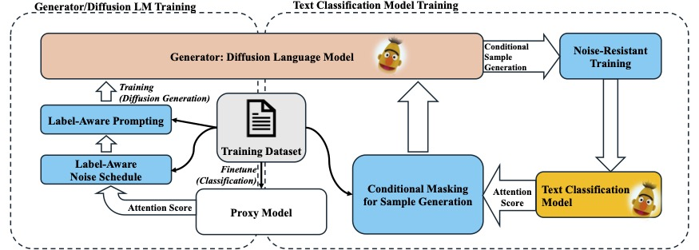

# An Effective Deployment of Diffusion LM for Data Augmentation in Low-Resource Sentiment Classification

*Zhuowei Chen, Yuben Wu, Xinfeng Liao, Yujia Tian, Junyang Zhong, Lianxi Wang | DM Lab (Guangdong Univerisity of Foreign Studies)*

Official repository for the paper **[An Effective Deployment of Diffusion LM for Data Augmentation in Low-Resource Sentiment Classification](https://arxiv.org/pdf/2409.03203)**.





## Abstract

> Sentiment classification (SC) often suffers from low-resource challenges such as domain-specific contexts, imbalanced label distributions, and few-shot scenarios. The potential of the diffusion language model (LM) for textual data augmentation (DA) remains unexplored, moreover, textual DA methods struggle to balance the diversity and consistency of new samples. Most DA methods either perform logical modifications or rephrase less important tokens in the original sequence with the language model. In the context of SC, strong emotional tokens could act critically on the sentiment of the whole sequence. Therefore, contrary to rephrasing less important context, we propose DiffusionCLS to leverage a diffusion LM to capture in-domain knowledge and generate pseudo samples by reconstructing strong label-related tokens. This approach ensures a balance between consistency and diversity, avoiding the introduction of noise and augmenting crucial features of datasets. DiffusionCLS also comprises a Noise-Resistant Training objective to help the model generalize. Experiments demonstrate the effectiveness of our method in various low-resource scenarios including domain-specific and domain-general problems. Ablation studies confirm the effectiveness of our framework's modules, and visualization studies highlight optimal deployment conditions, reinforcing our conclusions.


## Citation

```
@misc{chen2024effectivedeploymentdiffusionlm,
      title={An Effective Deployment of Diffusion LM for Data Augmentation in Low-Resource Sentiment Classification}, 
      author={Zhuowei Chen and Lianxi Wang and Yuben Wu and Xinfeng Liao and Yujia Tian and Junyang Zhong},
      year={2024},
      eprint={2409.03203},
      archivePrefix={arXiv},
      primaryClass={cs.CL},
      url={https://arxiv.org/abs/2409.03203}, 
}
```
